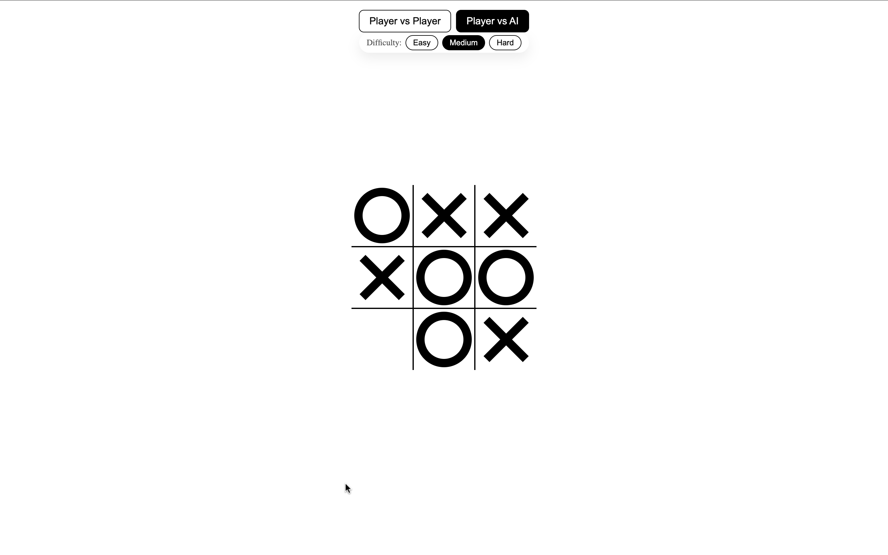
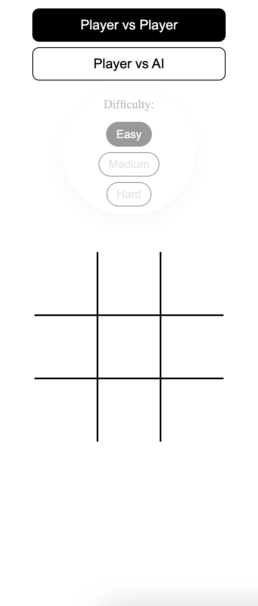
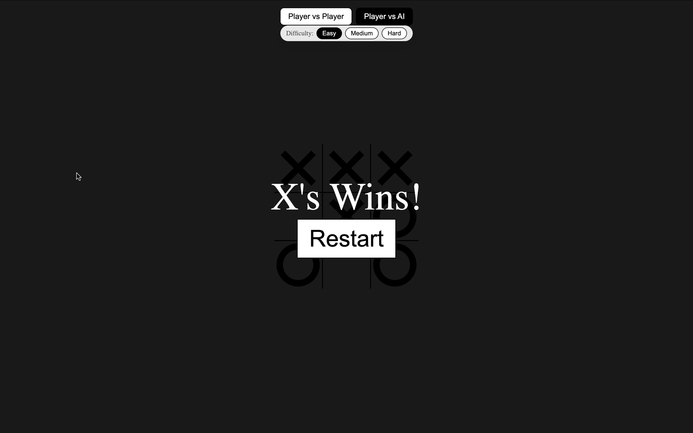

# Tic Tac Toe

## Tech Stack


A browser-based **Tic Tac Toe** game built using **HTML, CSS and vanilla JavaScript**.  
The game supports **Player vs Player** and **Player vs AI** with three difficulty levels, plus responsive layout for mobile.

---

## Overview

This project focuses on:

- Building a clean, responsive **3x3 game grid** using CSS Grid
- Implementing **turn-based game logic** in vanilla JavaScript
- Supporting multiple game modes: **vs Friend** and **vs AI**
- Implementing **three AI difficulty levels** (Easy, Medium, Hard)
- Showing a full-screen overlay for **win / draw** states

The goal of this project is to practice **core front-end fundamentals** and basic game/AI logic without using any frameworks.

---

## Screenshots

### Desktop gameplay



### Mobile layout (Player vs AI + difficulty selector)



### Win overlay



---

## ✅ Features

### Game Modes

- **Player vs Player**

  - Classic local 1v1 on the same device
  - Turn indicator using hover effects

- **Player vs AI**
  - Human always plays as **X**
  - AI plays as **O**
  - Three difficulty levels: **Easy / Medium / Hard**

---

### Difficulty Levels (AI)

- **Easy**

  - AI chooses a random available cell

- **Medium**

  - AI first checks if it can **win in one move**
  - If not, it checks if the player can win in the next move and **blocks**
  - Otherwise, it falls back to a random move

- **Hard (Minimax)**
  - AI uses the **Minimax algorithm** to evaluate the board
  - Plays optimally: it will never lose (only win or draw if the player also plays perfectly)

### Win Detection

- Based on predefined winning combinations:
  ```js
  const WINNING_COMBINATIONS = [
    [0, 1, 2],
    [3, 4, 5],
    [6, 7, 8],
    [0, 3, 6],
    [1, 4, 7],
    [2, 5, 8],
    [0, 4, 8],
    [2, 4, 6],
  ];
  ```
- Checks for a win after every move
- Displays a winning overlay message when a player wins

### Draw Detection

- If all 9 cells are taken without a winner, the game ends in a Draw
- A draw message is shown in the same overlay

### Learning Outcomes

Through this project I practiced:

- Structuring a small project with HTML, CSS and JS
- Using CSS Grid and CSS variables for layout and sizing
- Working with DOM events (addEventListener, { once: true })
- Building a clean, reusable win/draw detection system

---

### Responsive Design

On larger screens:

- Mode and difficulty selectors are displayed horizontally at the top
- The game board is centered both vertically and horizontally

On small screens (under ~553px):

- Mode buttons stack vertically
- Difficulty selector moves below and adapts to a pill-style control
- The board is moved lower to avoid overlap with the controls
- Cell size scales down using CSS variables (--cell-size)
